# DES

## Структура DES
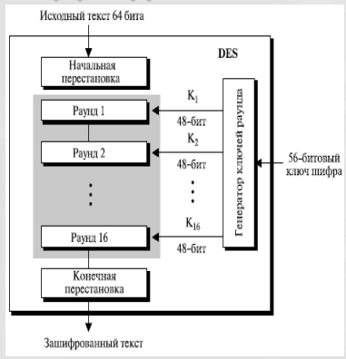
- Открытый текст шифруется блоками 64 бит, используя 64 битный ключ шифра (56 битов фактический ключ+8 битов четности).
- Процесс шифрования состоит из двух перестановок ( P -блоки) и 16-ти раундов Фейстеля.
- Каждый раунд использует различные 48-битовые раундовые ключи, сгенерированный на основе ключа шифра.
- Для шифрования и расшифрования используется один и тот же алгоритм и ключ.

## Раунды DES
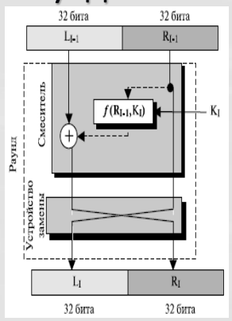
- На входе раунда субблоки от предыдущего раунда.
- Выполняется необратимое преобразование (функция DES) правого субблока.
- Вычисляется XOR левого субблока и результата преобразования.
- Субблоки меняются местами.

## Функция шифрования DES
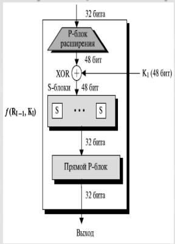
1. P-блок расширения (из 32 бит получаем 48 бит).
2. XOR результата расширения и ключа.
3. S-блок (из 48 бит получаем 32 бит).
4. Прямой P-блок (простая перестановка).
5. Получаем результат функции.

## Генерация раундовых ключей DES
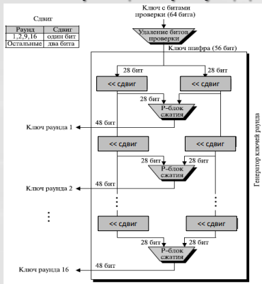
1. Удаление битов проверки (8,16,32,...,64).
2. Ключ разделяется пополам и выполняется перестановка. Получаем 56 бит фактического ключа.
3. Каждая половинка циклически сдвигается влево в зависимости от номера раунда.
4. Половинки ключа объединяются и обрабатываются P-блоком сжатия (из 56 бит получаем 48 бит).
5. Получаем ключ раунда, а вывод сдвигов переходят в пункт 3.

## Обратимость DES
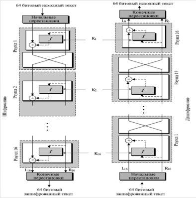
- Последний раунд отличается других: он содержать только смеситель и не содержит
устройства замены
- Ключи раундов применяются при шифровании и дешифровании в обратном порядке

## Проблемы DES
- Недостаточная длина ключа. Существует всего $2^{56}$.
- Проблемы с ключами шифрования (ключи являются слабыми или эквивалентными).
- S-блоки (основа алгоритма) конструировались таким образом, чтобы был возможен криптоанализ со стороны разработчика, который знает их слабые стороны (пока нет подтверждений).

# Double DES
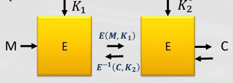

## Атака встреча посередине
$C = E(E(M, K_1), K_2)$ 
$M = E^{-1}(E^{-1}(C, K_2), K_1)$

# Triple DES
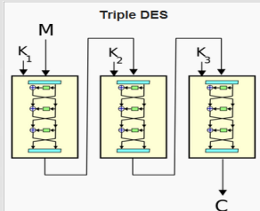

## Модификации:
- DES-EEE3
- DES-EDE3
- DES-EEE2
- DES-EDE2 
Самая популярная разновидность это DES-EDE3 и DES-EDE2

## ECB (электронная кодовая книга)
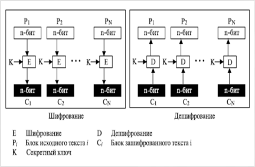
- Достоинства:
    - Шифрование может быть параллельным.
    - Ошибка в передаче блока не имеет никакого воздействия на другие блоки.
- Недостатки:
    - Одинаковые блоки открытого текста будут преобразовываться в одинаковые блоки шифротекста.
    - Независимость блоков создает возможность для замены некоторых блоков зашифрованного текста без знания ключа.

## CBC (сцепления блоков шифротекста)
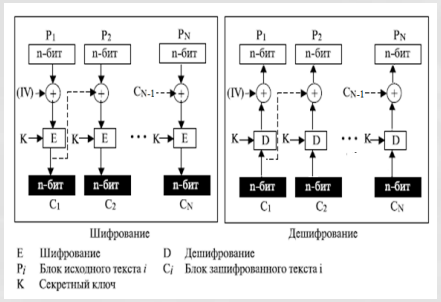
- Достоинства:
    - Одинаковые блоки исходного текста, преобразуются в различные блоки шифротекста.
    - Если произойдёт изменение одного бита шифротекста, то данная ошибка распространится на следующие блоки, но при расшифровке произойдет самовосстановление.
    - Последний блок шифротекста зависит от всех бит отрытого текста сообщения и может использоваться для контроля целостности сообщения.
- Недостатки:
    - Зашифрование сообщения не поддаётся распараллеливанию.

## CFB (обратная связь по шифру)
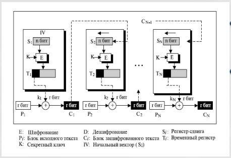
- Достоинства:
    - Это шифр потока, в котором ключевой поток зависит от зашифрованного текста.
    - В этом режиме не требуется дополнение блоков.
- Недостатки:
    - Ошибка в единственном бите шифротекста создает ошибку в следующих блоках до тех пор, пока, ошибка находятся в регистре сдвига.

## OFB (обратная связь по выходу)
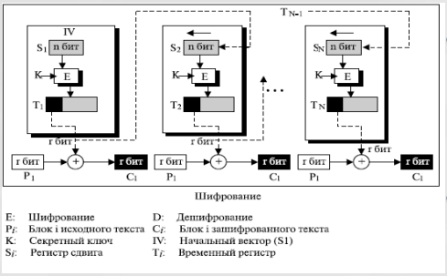
- Достоинства:
    - Фактически, это шифр потока, в котором ключевой поток не зависит от исходного и зашифрованного текста.
    - Каждый бит в зашифрованном тексте независим от предыдущего бита или битов.
    - Это позволяет избежать распространения ошибок. 
- Недостатки:
    - Чтобы одним и тем же ключом зашифровать больше, чем одно сообщение, значение IV должно быть изменено для каждого сообщения.

## CTR (счетчик)
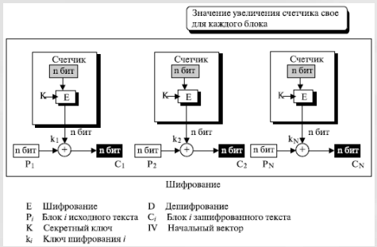
- Достоинства:
    - Создает n-битовый зашифрованный текст, блоки которого независимы друг от друга — они зависят только от значений счетчика. Фактически, это шифр потока.
    - Режим, подобно режиму ECB, может использоваться, чтобы зашифровать и расшифровывать файлы произвольного доступа, и значение счетчика может быть связано номером записи в файле.
- Недостатки:
    - Если значения счетчиков совпадает, то шифрование производится на одном ключе.

# Магма (ГОСТ 28147-89)

## Структура шифра
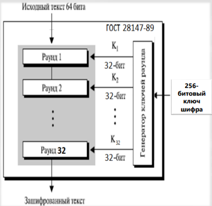
- Открытый текст шифруется блоками 64 бит, используя 256 битный ключ шифра.
- Процесс шифрования состоит из 32-х раундов схемы Фейстеля.
- Каждый раунд использует 32-битовый раундовый ключ, сгенерированный на основе ключа шифра.
- Для расшифрования используется тот же алгоритм и ключ.

## Раунды шифра
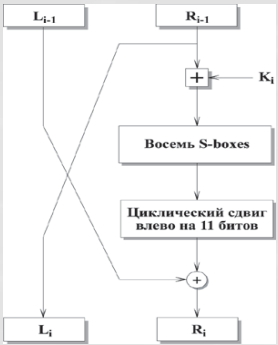

