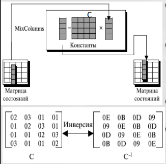
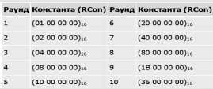

# DES

## Структура DES

- Открытый текст шифруется блоками 64 бит, используя 64 битный ключ шифра (56 битов фактический ключ+8 битов четности).
- Процесс шифрования состоит из двух перестановок ( P -блоки) и 16-ти раундов Фейстеля.
- Каждый раунд использует различные 48-битовые раундовые ключи, сгенерированный на основе ключа шифра.
- Для шифрования и расшифрования используется один и тот же алгоритм и ключ.

## Раунды DES

- На входе раунда субблоки от предыдущего раунда.
- Выполняется необратимое преобразование (функция DES) правого субблока.
- Вычисляется XOR левого субблока и результата преобразования.
- Субблоки меняются местами.

## Функция шифрования DES

1. P-блок расширения (из 32 бит получаем 48 бит).
2. XOR результата расширения и ключа.
3. S-блок (из 48 бит получаем 32 бит).
4. Прямой P-блок (простая перестановка).
5. Получаем результат функции.

## Генерация раундовых ключей DES

1. Удаление битов проверки (8,16,32,...,64).
2. Ключ разделяется пополам и выполняется перестановка. Получаем 56 бит фактического ключа.
3. Каждая половинка циклически сдвигается влево в зависимости от номера раунда.
4. Половинки ключа объединяются и обрабатываются P-блоком сжатия (из 56 бит получаем 48 бит).
5. Получаем ключ раунда, а вывод сдвигов переходят в пункт 3.

## Обратимость DES

- Последний раунд отличается других: он содержать только смеситель и не содержит
устройства замены
- Ключи раундов применяются при шифровании и дешифровании в обратном порядке

## Проблемы DES
- Недостаточная длина ключа. Существует всего $2^{56}$.
- Проблемы с ключами шифрования (ключи являются слабыми или эквивалентными).
- S-блоки (основа алгоритма) конструировались таким образом, чтобы был возможен криптоанализ со стороны разработчика, который знает их слабые стороны (пока нет подтверждений).

# Double DES

## Атака встреча посередине
$C = E(E(M, K_1), K_2)$ 
$M = E^{-1}(E^{-1}(C, K_2), K_1)$

# Triple DES

## Модификации:
- DES-EEE3
- DES-EDE3
- DES-EEE2
- DES-EDE2 
Самая популярная разновидность это DES-EDE3 и DES-EDE2

## ECB (электронная кодовая книга)

- Достоинства:
    - Шифрование может быть параллельным.
    - Ошибка в передаче блока не имеет никакого воздействия на другие блоки.
- Недостатки:
    - Одинаковые блоки открытого текста будут преобразовываться в одинаковые блоки шифротекста.
    - Независимость блоков создает возможность для замены некоторых блоков зашифрованного текста без знания ключа.

## CBC (сцепления блоков шифротекста)

- Достоинства:
    - Одинаковые блоки исходного текста, преобразуются в различные блоки шифротекста.
    - Если произойдёт изменение одного бита шифротекста, то данная ошибка распространится на следующие блоки, но при расшифровке произойдет самовосстановление.
    - Последний блок шифротекста зависит от всех бит отрытого текста сообщения и может использоваться для контроля целостности сообщения.
- Недостатки:
    - Зашифрование сообщения не поддаётся распараллеливанию.

## CFB (обратная связь по шифру)

- Достоинства:
    - Это шифр потока, в котором ключевой поток зависит от зашифрованного текста.
    - В этом режиме не требуется дополнение блоков.
- Недостатки:
    - Ошибка в единственном бите шифротекста создает ошибку в следующих блоках до тех пор, пока, ошибка находятся в регистре сдвига.

## OFB (обратная связь по выходу)

- Достоинства:
    - Фактически, это шифр потока, в котором ключевой поток не зависит от исходного и зашифрованного текста.
    - Каждый бит в зашифрованном тексте независим от предыдущего бита или битов.
    - Это позволяет избежать распространения ошибок. 
- Недостатки:
    - Чтобы одним и тем же ключом зашифровать больше, чем одно сообщение, значение IV должно быть изменено для каждого сообщения.

## CTR (счетчик)

- Достоинства:
    - Создает n-битовый зашифрованный текст, блоки которого независимы друг от друга — они зависят только от значений счетчика. Фактически, это шифр потока.
    - Режим, подобно режиму ECB, может использоваться, чтобы зашифровать и расшифровывать файлы произвольного доступа, и значение счетчика может быть связано номером записи в файле.
- Недостатки:
    - Если значения счетчиков совпадает, то шифрование производится на одном ключе.

# Магма (ГОСТ 28147-89)

## Структура шифра

- Открытый текст шифруется блоками 64 бит, используя 256 битный ключ шифра.
- Процесс шифрования состоит из 32-х раундов схемы Фейстеля.
- Каждый раунд использует 32-битовый раундовый ключ, сгенерированный на основе ключа шифра.
- Для расшифрования используется тот же алгоритм и ключ.

## Раунды шифра

1. На входе раунда субблоки от предыдущего раунда.
2. Правый субблок и раундовый ключ складываются по модулю $2^{32}$.
3. Результат сложения разбивается на восемь 4-битных значений, каждое из которых подается для замены на вход S-блока.
4. Выходы всех S-блоков объединяются в 32-битное слово, которое затем циклически сдвигается на 11 бит влево.
5. Вычисляется XOR результата с левым субблоком и результат обновляет правый субблок.

# Сравнительный анализ Магма и DES
- В ГОСТ применяется 256-битный ключ шифра, а в DES 56-битный . При выборе сильных S-блоков ГОСТ считается очень стойким алгоритмом.
- В DES применяются нерегулярные перестановки Р, в ГОСТ используется 11-битный циклический сдвиг влево. Поэтому ГОСТ требуется 8 раундов прежде, чем изменение одного входного бита повлияет на каждый бит результата; DES для этого нужно только 5 раундов.
- В DES только 16 раундов, в ГОСТ - 32 раунда, что делает его более стойким к дифференциальному и линейному криптоанализу.
- ГОСТ использует гораздо более простую процедуру создания раундовых ключей, чем DES.

# AES

## Струкутра шифра

- Используется Square-like структура (структура «квадрат»).
- Поддерживаются три версии (с 10, 12 и 14 раундами). Каждая версия использует различный размер ключа шифра (128, 192 или 256) и имеет соответствующее название: AES-128, AES-196, AES-256.
- Ключи раунда имеют тот же самый размер, что и блоки зашифрованного или исходного текста - всегда 128 бит.

## Раунд AES

- Раунд состоит из четырех различных обратимых преобразований, называемых слоями.
- Каждое преобразование модифицирует матрицу состояний.
- Каждый слой разрабатывался с учетом противодействия линейному и дифференциальному криптоанализу:
    - SubBytes - слой подстановок (замен) байтов для обеспечение нелинейных свойств шифра. 
    
    - ShiftRows - cлой линейного перемешивания строк. 
    
    - MixColums - слой линейного перемешивания столбцов. 
    
    - AddRoundKey - слой рандомизации с выполнением XOR промежуточного состояния с ключом раунда. 
    

## Расширения ключа

- Алгоритм расширения ключа ExpandKey создает последовательно (слово за словом) 128-битные раундовые ключи для $N_r$ раундов от единственного секретного ключа шифра.
- RotWord осуществляет циклический сдвиг байтов в слове влево.
- SubWord осуществляет замену каждого байта в слове в соответствии с методом подстановок, использованном в SubByte.
- Rcon(i) формирует константу, i-номер раунда. 

# Кузнечик (ГОСТ 34.12-18)

## Структура шифра

- SP-сеть с набором преобразований L, S, X. 

- Количество раундов - 9.
- Длина блока – 128 бит.
- Длина ключа – 256 бит.

## Расширения ключа

- Генерирует десять 128-битных итерационных (раундовых) ключей.
- Первые 2 ключа являются разбиением пополам основного ключа.
- Каждая пара следующих ключей определяется с помощью пары предыдущих, прошедших через 8 итераций сети Фейстеля. 
 

- Итерационные ключи создаются применением преобразования L к порядковому номеру итерации.

## Способы дополнения
- Дополняем «0000000...0» (нулями), если длина сообщения файла не кратна размеру блока. В общем случае получателю нужно знатдлину сообщения.
- Дополняем «10000000...0» (единица с нулями) всегда, т.е. и в случае кратности длины сообщения размеру блока.

## Режимы

# Атака предсказанием дополнения на режим CBC

- Цель: Расшифровать $C_2$, зная
правило дополнения блока открытого
текста $P_2$.
- Способ: Изменяем блок шифротекста, передаем измененный блок $C_1'$ и анализируем реакцию сервераполучателя на корректность
дополнения: $P_2'=D_2\oplus C_1'$.
- Знание реакции сервера-получателя позволяет восстановить $D_2=P_2'\oplus C_1'$.
- Расшифровка производится по правилу $P_2=D_2\oplus C_1$.

# Хэш-функция
Хэш-функцией называется математическая или иная функция, которая для строки бит произвольной длины вычисляет некоторую другую строку бит фиксированной длины (хэш-код).

## Односторонняя хэш-функция
- $Н(x)$ относительно легко (за полиномиальное время) вычисляется для любого значения $x$.
- Устойчива к прообразу: для любого данного значения хэш-кода
$h$ вычислительно сложно найти $x$ такое, что $x=H^{-1}(h)$.
- Устойчива ко второму прообразу: для любого данного $х$ вычислительно сложно найти $y: y \neq x\,\&\, H(y)=H (x)$.
- Устойчива к коллизиям: вычислительно сложно найти произвольную пару $(х, y)$ такую, что $H(y) = H(x)$ (признак сильной хэш-функции).

## Идеальная хэш-функция
- Для нового сообщения произвольной длины вырабатывается на выходе дайджест фиксированной длины, который представляет собой случайную строку нулей и единиц. Эта пара (сообщения, дайджест) образует запись в таблице.
- Когда поступает сообщение, для которого уже существует дайджест, выдается дайджест из соответствующей записи.
- Дайджест для нового сообщения должен быть выбран независимо от всех предыдущих дайджестов. Это подразумевает, что модель не может использовать формулу или алгоритм для вычисления дайджеста.
- Отношения между возможными сообщениями и возможными дайджестами – «многие к одному» (функциональность), поскольку длина дайджеста меньше длины сообщения.

## Модели атаки на идеальную на хэш-функцию
Использовать парадокс дней рождений.

## Виды атак на хэш-функции
1. Атака прообраза
    - Ева перехватила дайджест $D$; она хочет найти любое сообщение $М'$, такое, что $D = h(М')$. Ева может создать список $k$ сообщений и выполнить поиск.
    - Асимптотическая сложность атаки $O(2^{n})$.
2. Атака второго прообраза
    - Ева перехватила сообщение $M$', такое, чтобы $h(M) = h(М')$. Ева может создать список из $k – 1$ сообщений и выполнить поиск.
    - Асимптотическая сложность атаки $O(2^{n})$.
3. Атака коллизии
    - Ева должна найти два сообщения, $М$ и $М'$, такие, что $h(M) = h(М')$. Она может создать список из $k$ сообщений и выполнить эту проверку для всех пар.
    - Асимптотическая сложность атаки $O(2^{n/2})$.
4. Дополнительная атака коллизии
    - Ева создает $k$ различных вариантов $М (M_1, M_2 ,..., M_k)$ и $k$ различных вариантов $М' (M'_1, M'_2 ,... , M'_k)$. Оба набора значимы по содержанию. Затем Ева выполняет проверку для всех пар из наборов.
    - Асимптотическая сложность атаки $O(2^{n/2})$.

# MAC

- MAC гарантирует целостность и подлинность сообщения.
- Нет необходимости использовать два канала.
- Безопасность MAC зависит от безопасности основного алгоритма хэширования.
- Вложенный MAC:  

# HMAC
 
ipad и opad - константы.

# CMAC
 
Цель - создать один блок СMAC из $N$ блоков исходного текста, используя $N$ раз шифрование с симметричным ключом (режим CBC).

# MD5
 
- Хэш код 128 бит, блок 512 бит.
- Добавление в последний блок недостающих битов 100000...0.
- Добавление в последний блок 64 битного представления длины исходного сообщения $L_0$. $L_0 = L_0 \mod (2^{64})$.
- В итоге длина сообщения кратна 512.
- Инициализация MD буфера (4 регистра по 32 бита).

## Свойства
- Каждый бит хэш-кода является функцией от каждого бита входа.
- Многократное повторение элементарных функций обеспечивает хорошее перемешивание результата.
- MD5 является наиболее сильной хэш-функцией для 128-битного хэш-кода.

# SHA-1
 
- Добавление недостающих битов.
- Добавление 100000...0.
- Добавление длины исходного сообщения $L_0$.
- Инициализация MD буфера.

## Cравнения
 

# Keccak
 
Алгоритм состоит из двух этапов:
- Absorbing (впитывание). На каждом шаге очередной блок сообщения $p_i$ длиной $r$ подмешивается к части внутреннего состояния $S$, которая затем целиком модифицируется функцией $f$ - многораундовой бесключевой псевдослучайной перестановкой.
- Squeezing (отжатие). Чтобы получить хэш, функция $f$ многократно
применяется к состоянию, и на каждом шаге извлекается и
сохраняется кусок размера $r$ до тех пор, пока не получим выход $Z$
необходимой длины (путем конкатенации).

## Функция перестановок f
1. Принимает блоки размера r. Последний блок дополняется 100...001.
2. Выполняет над каждым блоком $12+2*l$ однотипных 5-ти шаговых раундов.
3. Шаги раунда - преобразования Тета $(\theta)$, Ро $(\rho)$, Пи $(\pi)$, Хи $(\chi)$, Йота $(\iota)$.
4. Состояние $S$ представляется трехмерным массивом бит, на которые далее ссылаются: $a[x][y][z]$ (на входе) и $A[x][y][z]$ на выходе.
5. Далее используется функция трансляции ROT выполняет следующую
операцию: $ROT(a[x][y][z], d) = a[x][y][(z+d)\mod 2^l]$.

## Keccak , как универсальный криптопримитив
- Простое добавление секретного ключа на вход хэшфункции Keccak превращает её в код аутентификациисообщений. Это было невозможно в обычных хэшфункциях SHA-1 или SHA-2 и требовало громоздкой конструкции HMAC.

- Добавление секретного ключа с открытымвектором инициализации и вывод гаммы произвольной длины превращает хэшфункции Keccak в потоковый шифр.

- Добавление на вход ключа, вектора инициализации и номера блока позволяет получить потоковый шифр с произвольным доступом — аналог блочного шифра в режиме счётчика (CTR). Это может быть использовано совместно с MAC для шифрования сообщений или пакетов данных.

- Использование входа и выхода переменной длины может применяться для генерации симметричных ключей из паролей. Если периодически уничтожать использованные предыдущие состояния, то из такой конструкции легко построить генератор псевдослучайных чисел.

# СТРИБОГ (ГОСТ Р 34.11–2012)
- Размер блока: 512 бит
- Размер выхода: 512 и 256 бит соответственно
- Число раундов: 12

## Функция сжатия g
 
- S (Substitution) - нелинейная биекция: аргументрассматриваются как массив из 64 байт, заменяемых по заданной стандартом таблице подстановки.
- P (Permutation) - переупорядочивание байт по определённому в стандарте порядку.
- L (Linear transformation) - линейное преобразование: блок рассматривается как $8 \times 64$-битных векторов, которые заменяется результатом умножения на определённую стандартом матрицу $64 \times 64$ над $GF(2)$.
- Е (Encryption) – функция симметричного шифрования.

